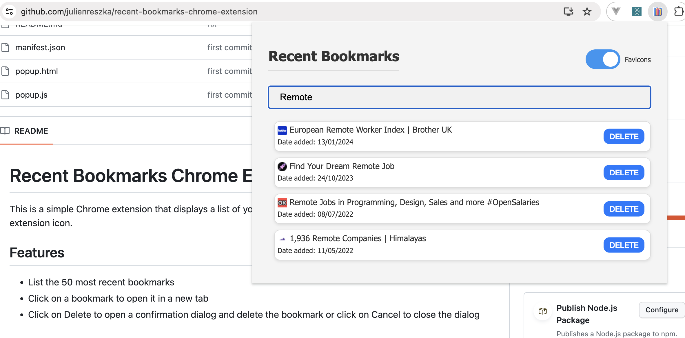

# Recent Bookmarks Chrome Extension

This is a simple Chrome extension that displays a list of your most recent bookmarks when you click on the extension icon.

## Screenshots

## Features

- List the 50 most recent bookmarks
- Search for bookmarks by title or url
- Click on a bookmark to open it in a new tab
- Click on Delete to open a confirmation dialog and delete the bookmark or click on Cancel to close the dialog

## Privacy

There is no bullshit you can look it up yourself because it's less than 1000 lines of code.

Be aware however that if you toggle favicons to true, it's querying google favicons.
This means that google will know which bookmarks you have.

## Installation

1. Clone this repository to your local machine.
2. Open Chrome and navigate to `chrome://extensions`.
3. Enable Developer mode by clicking the toggle switch at the top right.
4. Click the `Load unpacked` button and select the extension directory.

## Usage

Click on the extension icon to display a list of your 50 most recent bookmarks. Click on a bookmark to open it in a new tab.

## Permissions

This extension requires the `bookmarks` permission to access your Chrome bookmarks.

<!-- ## Contributing

Pull requests are welcome. For major changes, please open an issue first to discuss what you would like to change. -->

## License

[MIT](https://choosealicense.com/licenses/mit/)
